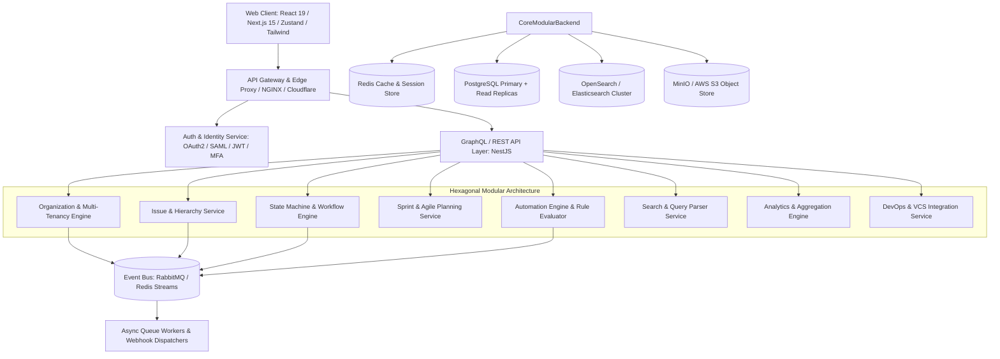
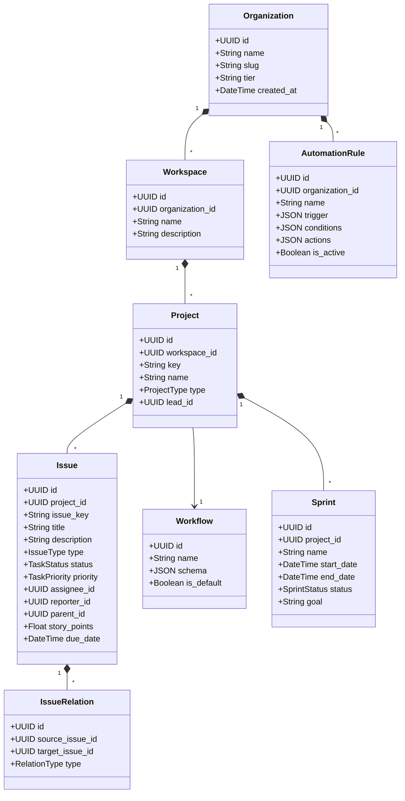
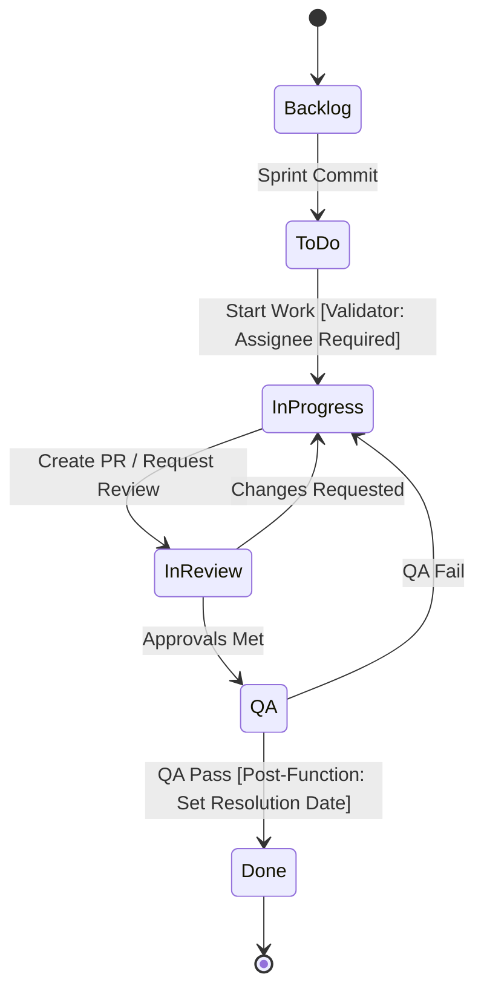
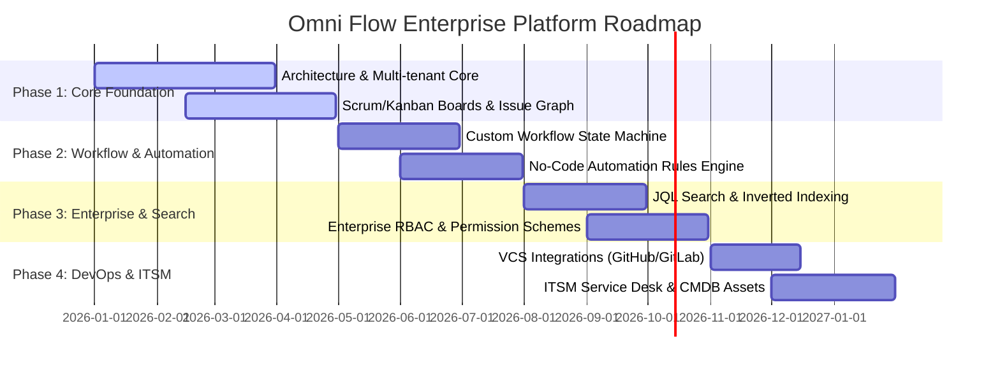

# Omni Flow Enterprise Work Management Platform Architecture

> **Document Version:** 1.0.0  
> **Status:** Approved / Foundation Phase 1 Specification  
> **Authors:** Principal Software Architects, Senior Product Managers, Security Engineers, Database Architects, DevOps Engineers, Full-Stack Leads  
> **Target Standard:** Enterprise-grade SaaS inspired by Atlassian Jira, Linear, Azure DevOps, ClickUp, and ServiceNow.

---

## 1. System Vision & Executive Summary

The Omni Flow platform is designed as an original, cloud-native, multi-tenant enterprise work management and agile governance operating system. Rather than duplicating legacy monolithic systems, Omni Flow is engineered from first principles using Clean Architecture, Domain-Driven Design (DDD), Event-Driven Microservices/Modular Monolith architecture, and CQRS patterns.

### Core Capabilities
* **Agile Software Development:** Scrum & Kanban boards, sprint capacity planning, velocity analytics, burndown/burnup forecasting, release roadmaps.
* **Business Operations & Work Management:** Flexible task hierarchies, custom forms, list views, Gantt schedules, automated triggers, portfolio rollups.
* **IT Service Management (ITSM):** Service desk queues, SLA management, incident response workflows, knowledge base integrations, problem & change management.
* **Asset Management & CMDB:** Configuration Item (CI) tracking, hardware/software inventory, dependency mapping, impact analysis.
* **Enterprise Governance & Security:** Granular RBAC/ABAC permission schemes, immutable audit logging, field-level security, SSO/SAML 2.0/OAuth2, SOC2/ISO27001 readiness.
* **Extensible Ecosystem:** API-first (GraphQL + OpenAPI REST), no-code visual automation engine, webhook mesh, plugin/app marketplace.

---

## 2. Product Requirements Document (PRD)

### 2.1 Strategic Goals & KPIs
1. **Performance:** Sub-100ms P95 API response times for read operations; sub-250ms for complex mutations.
2. **Scalability:** Multi-tenant architecture designed to scale seamlessly to 50,000+ organizations and 10,000,000+ concurrent issues.
3. **Reliability:** 99.99% availability with zero-downtime rolling deployments and regional disaster recovery.
4. **Usability:** Keyboard-first navigation (Command Palette `Cmd+K`), optimistic UI updates, responsive design across mobile, tablet, and ultra-wide displays.

### 2.2 Functional Requirements Matrix
| Module | Core Functionality | Acceptance Criteria |
| :--- | :--- | :--- |
| **Organizations & Workspaces** | Multi-tenant tenant separation, custom domain mapping, workspace nesting | Strict data isolation; zero cross-tenant data leakage via tenant context & RLS. |
| **Projects & Boards** | Scrum, Kanban, Gantt Timeline, List, Calendar views | Real-time drag-and-drop state transitions, WIP limits, swimlanes by assignee/priority/epic. |
| **Issues & Hierarchy** | Epics $\rightarrow$ Stories/Tasks/Bugs $\rightarrow$ Subtasks; multi-type relationships | Bi-directional issue linking (blocks, relates to, duplicates, parent-child) with cycle detection. |
| **Workflow Engine** | Configurable state machine with transitions, validators, conditions, post-functions | Custom visual workflow builder; transition guards based on roles, field values, and approvals. |
| **Sprint Management** | Velocity calculation, story points, sprint backlog grooming, sprint lifecycle | Automated carryover of incomplete tasks, real-time burndown chart calculation. |
| **Search (JQL-like)** | Advanced query syntax (`project = ENG AND status in (Open, "In Progress") ORDER BY priority DESC`) | Lexer/parser supporting logical operators, nested groupings, date macros (`now()`, `startOfWeek()`). |
| **Automation Engine** | Event-driven trigger-action rules (`WHEN status changes THEN assign to QA AND post Slack message`) | Asynchronous non-blocking queue processing with retry mechanics and rate limiting. |
| **DevOps Integrations** | GitHub, GitLab, Bitbucket, CI/CD pipelines, feature flags | Automatic issue state updates on pull request open/merge, commit linking, deployment tracking. |

---

## 3. High-Level Architecture

The platform adopts a decoupled **Hexagonal (Ports and Adapters) & Clean Architecture** model, ensuring core business logic is isolated from frameworks, databases, and third-party APIs.



---

## 4. Domain Model & Bounded Contexts



### Bounded Contexts
1. **Identity & Access Management (IAM):** Users, Organizations, Teams, Roles, Permissions Schemes, Field Security.
2. **Work Management:** Projects, Issue Hierarchy (Epics, Stories, Tasks, Bugs, Subtasks), Backlogs, Sprints.
3. **Workflow & State Execution:** Workflow Schemes, Transitions, Validators, Guards, Post-actions.
4. **Search & Discovery:** Inverted indexes, JQL query parsing, AST generation, SQL/OpenSearch translation.
5. **Automation & Events:** Event dispatcher, Rule DSL compiler, Execution sandboxes, Rate limiters.
6. **Reporting & Business Intelligence:** Time tracking, burndown projections, cycle time / lead time analytics.
7. **ITSM & CMDB:** Service tickets, SLAs, customer satisfaction (CSAT), asset dependency graphs.

---

## 5. Technology Decisions & Rationale

| Layer | Selected Tech | Rationale | Alternatives Considered |
| :--- | :--- | :--- | :--- |
| **Frontend Framework** | React 19 + TypeScript + Tailwind CSS | Component modularity, optimal DOM reconciliation, type safety, low bundle footprint. | Vue 3, Svelte (React ecosystem has broader enterprise component support). |
| **State & Data Fetching** | Zustand + TanStack Query | Lightweight decoupled store with high-performance server-state caching and deduplication. | Redux Toolkit (more boilerplate), MobX. |
| **Backend API** | Node.js + NestJS + Express/Fastify | Modular architecture out of the box, dependency injection, first-class GraphQL/REST support. | Go/Gin (slower developer iteration), Django/Python (lower concurrency efficiency for node I/O). |
| **Database** | PostgreSQL 16+ with Row-Level Security (RLS) | ACID compliance, JSONB support for dynamic schemas, relational integrity, robust indexing. | MongoDB (lacks transactional safety across complex issue graphs), MySQL. |
| **Caching & Messaging** | Redis + RabbitMQ / BullMQ | Sub-millisecond cache lookups, distributed locks, reliable dead-letter-queue async processing. | Kafka (excessive overhead for medium tenant clusters). |
| **Search Engine** | OpenSearch / Elasticsearch | Tokenized full-text search, fuzzy search, faceted queries, fast aggregation on millions of issues. | Postgres tsvector (insufficient for complex JQL facet scaling). |
| **Object Storage** | MinIO / AWS S3 | S3-compatible, distributed, signed upload URLs for high security and direct client streaming. | Local disk storage (not cloud-native). |

---

## 6. Multi-Tenancy Strategy

Multi-tenancy is enforced through a **Logical Isolation with Row-Level Security (RLS) and Tenant Context Middleware**:

1. **Tenant Identification:** Every incoming request extracts the tenant (`organization_id` & `workspace_id`) via validated JWT claims or domain subdomains.
2. **Database Security (PostgreSQL RLS):**
   ```sql
   ALTER TABLE tasks ENABLE ROW LEVEL SECURITY;
   CREATE POLICY tenant_isolation_policy ON tasks
     FOR ALL
     USING (organization_id = current_setting('app.current_org_id')::uuid);
   ```
3. **Connection Pooling & Query Context:** The NestJS/Prisma database interceptor sets local session configuration parameters per request:
   `SET LOCAL app.current_org_id = 'tenant-uuid';`
4. **Data Isolation Testing:** Automated security suite executes cross-tenant query probes in CI/CD to prevent leakage.

---

## 7. Workflow Engine Specification

The workflow engine models issue progression via a directed graph:



### Components of Every Transition:
* **Conditions:** Determines if transition button is visible (e.g. `UserInRole("Developer")`).
* **Validators:** Checks field constraints before transition completes (e.g. `FixVersion is NOT NULL`).
* **Post-Functions:** Actions executed immediately after state changes (e.g. `UpdateField("resolution", "Fixed")`, `TriggerWebhook("slack-notify")`).
* **Screen:** Optional modal form presented to the user during transition to capture transition-specific details (e.g., Close Reason, Time Spent).

---

## 8. Database Architecture & Schema Strategy

### Key Schema Entities (PostgreSQL / Prisma)
* `organizations`: Tenant root, subscription tiers, SSO configs.
* `user_profiles`: User identity, global & org roles, preferences.
* `workspaces`: Subdivisions within an enterprise.
* `projects`: Project key, type, workflow scheme mapping.
* `tasks` / `issues`: Core polymorphic work unit (Title, Description, Status, Priority, Type, Story Points, Due Date, Reporter, Assignee, Parent ID).
* `task_relations`: Graph edges (`blocks`, `is_blocked_by`, `relates_to`, `duplicates`).
* `task_comments` & `task_attachments`: Collaboration threads & binary storage references.
* `task_activity_logs`: Immutable audit trails recording every change delta (`previous_value`, `new_value`).
* `sprints`: Time-boxed iterations with velocity and capacity metadata.
* `automation_rules` & `automation_logs`: Configurable rules with event triggers, JSON logic trees, and run histories.

---

## 9. DevOps, Observability & Deployment Strategy

### Deployment Architecture
* **Containerization:** Docker multi-stage builds producing hardened non-root container images.
* **Orchestration:** Kubernetes (EKS/GKE) with Horizontal Pod Autoscaling (HPA) based on CPU and Request Queue Depth.
* **CI/CD:** GitHub Actions automated pipelines:
  * Stage 1: Static code analysis, TypeScript compilation, ESLint validation.
  * Stage 2: Unit tests, RLS security validation, API contract tests.
  * Stage 3: Docker container build, container image scanning (Trivy).
  * Stage 4: Canary deployment to staging and production with automated rollback on error budget breach.
* **Observability Stack:**
  * OpenTelemetry instrumentation for distributed traces.
  * Prometheus for metric collection (requests/sec, error rate, memory, DB latency).
  * Grafana dashboards for cluster and application health monitoring.

---

## 10. Phased Development Roadmap



---

## 11. Current Platform Feature Audit & Status

### Working Features:
*  **Multi-View Task System:** Kanban Board, Gantt Timeline, Task List, and My Tasks views with drag-and-drop status and timeline bar manipulation.
*  **Dynamic Task Details Modal:** General, QA, and Admin tabs; Comments, Activity History, Worklogs, File Attachments with signed URLs, Subtasks hierarchy, and AI subtask generation.
*  **Cross-Project Task Retrieval:** Direct opening of any task by ID across My Tasks, Upcoming Tasks, and Overview dashboard with automatic project context synchronization.
*  **Responsive Analytics & Charts:** Mobile-optimized, non-clipping Recharts data visualizations for Workload, Velocity Trends, Milestone progress, and Priority distributions.
*  **Automations Dashboard:** Event trigger configuration and rules management engine.
*  **Role-Based Access & Dashboards:** Persona-based dashboards for Owner, Admin, Project Manager, Member, and Client Viewer.
*  **AI Integration:** Gemini-powered task summary generator and subtask decomposition.
*  **Security & Audit Logging:** Comprehensive audit event logging across CRUD operations.
